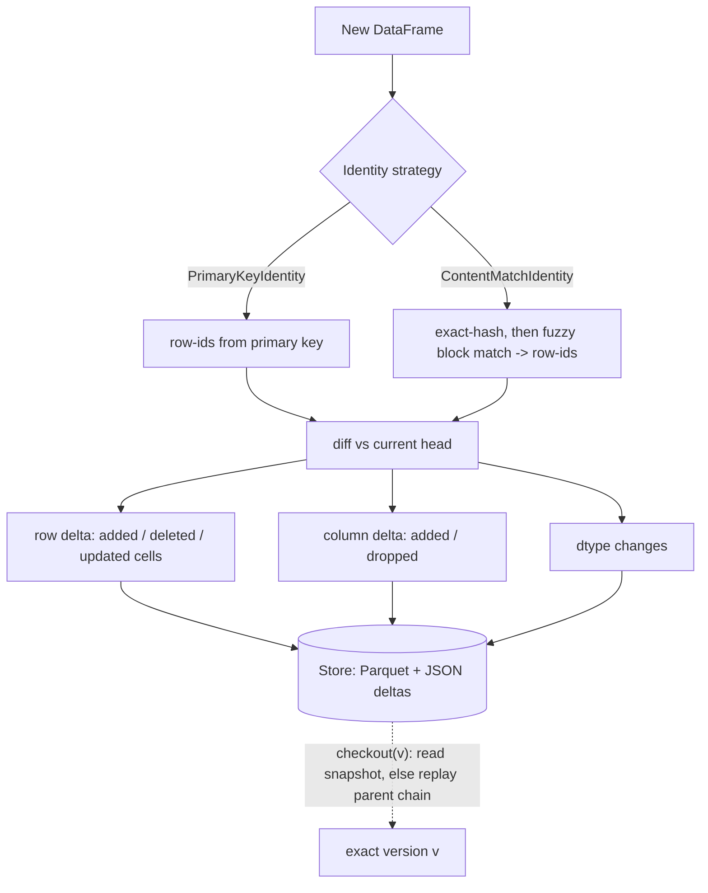

# DeltaTrace

**Git-style version control for tabular data.** DeltaTrace records a sequence of
versions of a DataFrame, storing only the *delta* between consecutive versions
(new / changed rows, deleted rows, added / dropped columns, dtype changes) plus
a small metadata file. Any historical version can be reconstructed exactly by
replaying deltas along the parent chain — optionally short-circuited by a
snapshot.

Think of it as a tiny, dependency-light cousin of Delta Lake / DVC for a single
table: **commit → log → diff → checkout (time-travel)**, backed by Parquet.


## Contents

- [Why](#why)
- [Features](#features)
- [Architecture](#architecture)
- [Install](#install)
- [Quickstart (Python)](#quickstart-python)
- [Quickstart (CLI)](#quickstart-cli)
- [How it works](#how-it-works)
- [Project layout](#project-layout)
- [Benchmarks](#benchmarks)
- [Design notes &amp; limitations](#design-notes--limitations-honest)
- [Provenance](#provenance)
- [License](#license)

---

## Why

A dataset is rarely static — rows get appended, values get corrected, columns
get added or retyped. Keeping a full copy per version wastes space, and a pile
of `data_v3_final_FINAL.parquet` files loses the *what changed and why*. Git
solves this for code with content-addressed deltas; DeltaTrace applies the same
idea to a table, keyed by a **primary key** so "the same row" is well-defined
across versions.

**No primary key? DeltaTrace still works.** A large share of real data — CSV
exports, scraped tables, sensor dumps, public ML datasets — has no natural key.
Without one, a versioning tool cannot tell an *edited* row from a *deleted + newly
inserted* one, so every correction balloons into a full re-insert and the audit
trail is lost. DeltaTrace's `ContentMatchIdentity` **recovers** row identity from
content (exact hashing, then a tolerance-aware fuzzy pass), so an edit is stored
as a few changed cells — and, crucially, a wrong guess only ever costs storage,
never correctness (see [error confinement](#correctness)).

## Features

- **Delta commits** — each version stores only what changed from its parent.
- **Exact time-travel** — `checkout(v)` reconstructs any past version; a test
  suite asserts `reconstruct(v) == original(v)` for every version.
- **Row + column + type tracking** — appends, deletes, cell updates, added /
  dropped columns and dtype changes are all captured.
- **Snapshots** — cache a full materialisation of a version to skip replay;
  optional auto-snapshot every *N* commits.
- **Append-only log & diffs** — `log()` and `diff(a, b)` for auditability.
- **Primary-key row identity** — works on any freshly-loaded DataFrame, not just
  one you mutate in place.
- **Keyless row identity** — `ContentMatchIdentity` recovers identity on tables
  with *no* primary key via exact-hash + fuzzy content matching, turning edits
  into cell-level deltas instead of delete + re-insert.
- **Cell-level update deltas** — an edited row stores only the columns that
  actually changed, not the whole row.
- **CLI + Python API**, Parquet storage, only `pandas` + `pyarrow` required.

## Architecture

DeltaTrace cleanly separates *what changed* (the delta engine) from *how "the same
row" is decided* (a pluggable **identity strategy**). A commit assigns stable row-ids
via the active strategy, diffs the frame against the current head, and persists only
the components that changed; `checkout` replays those components — short-circuited by a
snapshot when one exists.



## Install

```bash
git clone https://github.com/Viswas-Reddy-PallamReddy/DeltaTrace.git
cd DeltaTrace
pip install -e .            # core (pandas + pyarrow + numpy)
pip install -e ".[fast]"   # + rapidfuzz: accelerates keyless matching (recommended)
pip install -e ".[dev]"    # + pytest to run the tests
```

## Quickstart (Python)

```python
import pandas as pd
from deltatrace import DeltaRepo

repo = DeltaRepo.init("my_store", primary_key="id", overwrite=True)

df = pd.DataFrame({"id": [1, 2, 3], "city": ["A", "B", "C"], "pop": [10, 20, 30]})
repo.commit(df, "initial load")

df2 = df.copy()
df2.loc[df2.id == 2, "pop"] = 999                                   # update a row
df2 = pd.concat([df2, pd.DataFrame({"id": [4], "city": ["D"], "pop": [40]})],
                ignore_index=True)                                  # append a row
repo.commit(df2, "bump city B, add city D")

repo.diff(1, 2)        # -> +1/-0/~1 rows; cols +[] -[]; types []
repo.checkout(1)       # -> exactly the original v1 DataFrame
```

### Keyless tables (no primary key)

When the data has no key, swap in `ContentMatchIdentity`. Everything else — the
delta engine, reconstruction, the log — is identical; only how "the same row" is
decided changes.

```python
from deltatrace import DeltaRepo, ContentMatchIdentity

# block_on names cheap, stable columns that narrow down match candidates
repo = DeltaRepo.init("store", identity=ContentMatchIdentity(block_on=["city", "metric"]))

repo.commit(readings_jan)            # full base
r = repo.commit(readings_feb)        # one cell corrected, one row added, one removed
r.stats                              # -> {'updated': 1, 'added': 1, 'deleted': 1, ...}
repo.explain_last()                  # per-row: matched exactly / fuzzily / inserted
```

A pure content-hashing tool would record that single-cell correction as a delete
**plus** a full re-insert (`exact_only=True` reproduces that baseline). DeltaTrace
recognises it as one update — and reconstructs every version exactly regardless.

## Quickstart (CLI)

```bash
deltatrace init   my_store --primary-key id
deltatrace commit my_store january.parquet -m "january load"
deltatrace commit my_store february.parquet -m "february load"
deltatrace log    my_store
deltatrace diff   my_store 1 2
deltatrace checkout my_store --version 1 --out v1.parquet
deltatrace snapshot my_store --version 2
```

Run the bundled demo:

```bash
python examples/demo.py
```

## How it works

### Storage layout

```
my_store/
  deltatrace.json          repo config: primary_key, head, format version
  base/v1.parquet          full materialisation of version 1
  versions/v<N>/
    metadata.json          version, parent, schema, message, stats, components
    upserts.parquet        full rows (carried columns) for newly inserted ids
    updates.parquet        only the changed cells for edited ids
    deleted_ids.json       row ids removed in this version
    added_columns.parquet  values for columns introduced in this version
    removed_columns.json   names of columns dropped in this version
    updated_cells.parquet  optional (row_id, column, old, new) audit log
  snapshots/v<N>.parquet   optional full materialisation (reconstruction cache)
  logs/history.jsonl       append-only commit log (one JSON object per line)
```

### Row identity

Identity is a **pluggable strategy** — the delta engine only requires that each
version arrives with a consistent internal row-id column, so it never has to know
*how* identity was decided.

- **`PrimaryKeyIdentity` (default).** Every row gets a deterministic id derived
  from the user-declared **primary key** (single or composite). The same logical
  row maps to the same id in every version, so diffing two arbitrary DataFrames is
  just set algebra on ids — no fragile positional alignment.
- **`ContentMatchIdentity` (keyless).** With no key to lean on, identity is
  *recovered* by matching each version against the previous one: a multiplicity-
  aware exact-hash join first, then a tolerance-aware fuzzy pass over the leftovers
  (numeric tolerance, string similarity, blocking for speed). The string-similarity
  step uses **rapidfuzz** when installed (a small C-extension) and transparently
  falls back to the stdlib `difflib` otherwise, so the core stays dependency-light.
  Matched rows inherit their parent's id; genuinely new rows get a fresh one.
  `exact_only=True` drops the fuzzy pass to emulate a plain content-hashing system.

Whatever a strategy guesses, **reconstruction stays exact** — see Correctness.

### The delta model

A commit diffs the new DataFrame against the current head and decomposes the
change into independent components:

| change            | stored as                                  |
|-------------------|--------------------------------------------|
| inserted rows     | full rows in `upserts.parquet`             |
| updated rows      | only the changed cells in `updates.parquet`|
| deleted rows      | id list in `deleted_ids.json`              |
| added columns     | id → value map in `added_columns.parquet`  |
| dropped columns   | name list in `removed_columns.json`        |
| dtype changes     | recorded in `metadata.json` schema         |

Crucially, row-level and column-level changes are kept **separate**, and inserts
are kept separate from updates: adding a column does not rewrite every row,
updating a few rows does not rewrite the schema, and correcting one cell stores
*that cell*, not the whole row. Recovering row identity is exactly what makes the
last point possible — an update can only be a few cells if you know which parent
row it continues.

### Reconstruction (`checkout`)

`checkout(v)` walks the parent chain and replays deltas:

```
reconstruct(v):
    if snapshot(v) exists:        return snapshot(v)        # short-circuit
    if v == 1:                    return base/v1
    frame = reconstruct(parent(v))                          # recurse
    frame = drop removed columns
    frame = remove deleted ids
    frame = upsert changed / new rows by id
    frame = attach added columns by id
    return cast(frame, schema(v))
```

Cost is `O(depth × rows)` in the worst case; a snapshot collapses it to a single
read, trading storage for reconstruction speed. `snapshot_interval=N` automates
this every *N* commits.

### Correctness

`tests/test_repo_roundtrip.py` builds an 8-version dataset that exercises *every*
delta type (append, delete, update, add column, drop column, dtype change) and
asserts each version reconstructs exactly. `tests/test_snapshot.py` additionally
deletes every base/delta file after snapshotting and proves `checkout` still
succeeds purely from the snapshot.

**Error confinement (the keyless safety guarantee).** Reconstruction fidelity
depends only on a row's final *contents*, never on how well identity was matched.
A wrong match changes whether an edit is stored as an update or as a
delete + insert — i.e. storage and provenance — but the materialised version is
identical either way. `tests/test_content_match.py` proves this by sweeping the
match threshold from 0.0 (matches almost anything) to 1.0 (matches nothing) and
asserting exact reconstruction at every setting. The matcher trades space; it can
never corrupt data.

```bash
pip install -e ".[dev]"
pytest -q          # 43 passed
```

## Project layout

```
DeltaTrace/
├── deltatrace/
│   ├── repo.py        DeltaRepo: commit / checkout / diff / log / snapshot
│   ├── identity.py    PrimaryKeyIdentity + ContentMatchIdentity (pluggable row id)
│   ├── matching.py    keyless engine: canonicalisation, row hashing, fuzzy block match
│   ├── diffing.py     row / column / type / cell-level diffs over row-ids
│   ├── storage.py     on-disk Store: Parquet + JSON, repo scaffold, history log
│   └── cli.py         `deltatrace` command-line entry point
├── tests/             43 pytest cases (round-trip, snapshot, keyless, diff, CLI)
├── benchmarks/        synthetic histories over famous keyless datasets + scoring
├── examples/demo.py   runnable end-to-end demo
├── notebooks/         prototype + keyless demo + full benchmark notebooks
├── pyproject.toml     packaging; installs the `deltatrace` CLI
└── README.md
```

## Benchmarks

`benchmarks/` synthesises realistic version histories (≈6% edits, 2% inserts, 2%
deletes per version) from **famous keyless datasets** — iris, penguins, titanic,
diamonds, and the UCI adult/census set — with a *hidden* ground-truth key so we
can both run an oracle and score identity recovery. Four systems are compared:
`naive` (full snapshots), `hash-only` (`exact_only=True`), `DeltaTrace`, and an
`oracle` given the perfect key. Reproduce it in:

- [`notebooks/01_keyless_versioning_demo.ipynb`](notebooks/01_keyless_versioning_demo.ipynb)
  — the keyless model on a toy table + a visual error-confinement proof.
- [`notebooks/02_benchmark_famous_datasets.ipynb`](notebooks/02_benchmark_famous_datasets.ipynb)
  — the full comparison with charts.

Headline results (10-version histories):

| metric | hash-only | **DeltaTrace** | oracle |
|---|---|---|---|
| identity recall (edits caught), avg | ~0.94 | **~0.99** | 1.00 |
| storage saved vs naive — diamonds (~20k rows) | 38% | **47%** | 49% |
| storage saved vs naive — adult (~20k rows) | 2% | **19%** | 19% |
| every version reconstructs exactly | ✅ | ✅ | ✅ |

Two honest caveats the notebooks make explicit: identity recovery is a **universal
win** (hash-only structurally cannot recognise an edited row, so it mis-classifies
thousands of them), but the **storage** win only appears at scale — on KB-class
tables the parquet per-file floor dominates and plain snapshots are smaller.

## Design notes & limitations (honest)

- **In-memory engine.** Diffing and reconstruction run in pandas; this targets
  datasets that fit in memory, not billion-row tables. The on-disk format is the
  interesting part and would port to a chunked/streaming executor.
- **Snapshots are the scaling lever.** Long history chains make `checkout` walk
  many deltas; snapshots (manual or `snapshot_interval`) bound that cost.
- **Linear history.** One head, no branching/merge yet — a natural next step
  given ids and per-version metadata are already in place.
- **Keyless identity is a heuristic.** `ContentMatchIdentity` recovers identity by
  matching, so on tables with many identical rows it can attribute an edit to the
  "wrong" duplicate. By error confinement this only affects storage/provenance,
  never reconstruction — but if you *have* a reliable key, prefer it.
- **Matching is a write-time cost; reads are not.** Identity recovery runs only at
  `commit`. On wide, string-heavy tables the fuzzy residual pass dominates commit
  latency; it is accelerated with rapidfuzz plus vectorised per-block similarity
  matrices (≈2–3× faster than the pure-Python/`difflib` path on the benchmark's
  largest tables). `checkout`/time-travel replay is identity-agnostic and stays
  flat regardless of which identity strategy was used.
- **Single-writer.** No concurrency control; intended for batch/offline use.

## Provenance

DeltaTrace began as a Colab notebook prototype (kept at
[`notebooks/prototype.ipynb`](notebooks/prototype.ipynb)) that demonstrated the
core idea on NYC-taxi Parquet data. This package generalises that prototype into
an installable library + CLI with pluggable key-based **and keyless** identity,
automatic diff-on-commit, separated row/column and insert/update deltas, an
append-only log, a regression test suite, and a benchmark suite against famous
keyless datasets.

## License

MIT — see [LICENSE](LICENSE).
